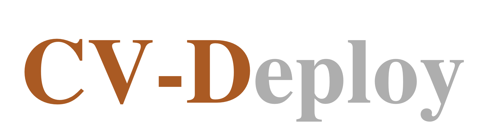

<h2 align="center">AI model deployment based on NVIDIA and Qualcomm platforms</h2>

[**Architecture**](./docs/framework.md)&nbsp;&nbsp;&nbsp;|&nbsp;&nbsp;&nbsp;[**Documentation**](https://liwuhen.cn/CVDeploy-2D)&nbsp;&nbsp;&nbsp;|&nbsp;&nbsp;&nbsp;[**Blog**](https://www.zhihu.com/column/c_1839603173800697856)&nbsp;&nbsp;&nbsp;|&nbsp;&nbsp;&nbsp;[**Roadmap**](./docs/roadmap.md)&nbsp;&nbsp;&nbsp;|&nbsp;&nbsp;&nbsp;[**Slack**](https://app.slack.com/client/T07U5CEEXCP/C07UKUA9TCJ)

---

The repository mainly provides 2D model inference functionality, and the code provides daily development of packaged libs for integration, testing, and inference. The framework provides multi-threaded, singleton pattern, producer and consumer patterns. Cache log analysis is also supported.

#  Third-party Libraries

|Libraries|Eigen|Gflags|Glog|Yaml-cpp|Cuda|Cudnn|Tensorrt|Opencv|
|:-:|:-:|:-:|:-:|:-:|:-:|:-:|:-:|:-:|
|Version|3.4|2.2.2|0.6.0|0.8.0|11.4|8.4|8.4|3.4.5|

# Getting Started
Visit our documentation to learn more.
- [Installation](./docs/hpcdoc/source/getting_started/installation.md)
- [Quickstart](./docs/hpcdoc/source/getting_started/Quickstart.md)
- [Supported Models](./docs/hpcdoc/source/algorithm/Supported_Models.md)
- [Supported Object Tracking](./docs/hpcdoc/source/algorithm/Supported_Object_Tracking.md)

# Performances
- Dataset: The validation dataset is TinyCOCO, which contains 1,000 training samples and 500 test samples. All models in the table were trained on the full COCO2017 dataset.
- Model: The deployed model is the 's' version of the YOLO series.
- Quantize: Quantization was performed using NVIDIA's Post-Training Quantization (PTQ) method.

|Model|Platform|Resolution|mAP50-95(fp32)|mAP50(fp32)|mAP50-95(fp16)|mAP50(fp16)|mAP50-95(int8)|mAP50(int8)|
|:-:|:-:|:-:|:-:|:-:|:-:|:-:|:-:|:-:|
|[Yolov5s](https://drive.google.com/drive/folders/1_0YjElSSMCbeTdD2FUbJE6zIHsHhynug)|RTX4060/orin x|640x640|0.458|0.619|0.459|0.619|0.424|0.576|-|
|[Yolov8s](https://drive.google.com/drive/folders/1_0YjElSSMCbeTdD2FUbJE6zIHsHhynug)|RTX4060/orin x|480x640|0.467|0.622|0.468|0.622|0.453|0.604|-|
|[Yolov11s](https://drive.google.com/drive/folders/1_0YjElSSMCbeTdD2FUbJE6zIHsHhynug)|RTX4060/orin x|480x640|0.491|0.656|0.491|0.657|0.458|0.607|-|
|[Yolox](https://drive.google.com/drive/folders/1_0YjElSSMCbeTdD2FUbJE6zIHsHhynug)|RTX4060/orin x|416x416|-|-|-|-|-|-|-|

#  Contributing
Welcome users to participate in these projects. Please refer to [CONTRIBUTING.md](./CONTRIBUTING.md) for the contributing guideline.We encourage you to join the effort and contribute feedback, ideas, and code. You can participate in Working Groups, Working Groups have most of their discussions on [Slack](https://app.slack.com/client/T07U5CEEXCP/C07UKUA9TCJ) or QQ (938558640).

https://drive.google.com/drive/folders/1_0YjElSSMCbeTdD2FUbJE6zIHsHhynug
# References
- [Yolox: https://github.com/Megvii-BaseDetection/YOLOX](https://github.com/Megvii-BaseDetection/YOLOX)
- [Ultralytics: https://github.com/ultralytics/ultralytics](https://github.com/ultralytics/ultralytics)
- [Setup Environment: https://zhuanlan.zhihu.com/p/818205320](https://zhuanlan.zhihu.com/p/818205320)
