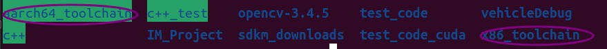
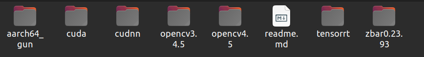

# Quickstart


## 1. 构建项目

### 1.1 Docker环境下配置arm 版本gcc与g++交叉编译环境

- 在**platforms/arm**目录下，arm-toolchain.cmake中替换以下路径为docker容器中arm工具链的路径(arm工具链的路径具体路径可自行决定)

    ```shell
    # Setting up your computer's arm gcc,g++ environment -- arm version
    set(CMAKE_C_COMPILER
        /home/IM/aarch64_toolchain/aarch64_gun/bin/aarch64-buildroot-linux-gnu-gcc)
    set(CMAKE_CXX_COMPILER
        /home/IM/aarch64_toolchain/aarch64_gun/bin/aarch64-buildroot-linux-gnu-g++)
    set(CMAKE_FIND_ROOT_PATH
        /home/IM/aarch64_toolchain/aarch64_gun/aarch64-buildroot-linux-gnu/sysroot)
    ```
- 在**cmake/third_library.cmake**中配置arm 版本cuda与tensorrt交叉编译环境
    ```shell
    # Setting up your computer's cuda and tensorrt environment -- arm version
    set(CUDA_TOOLKIT_ROOT_DIR "/home/aarch64_toolchain/cuda")
    set(TENSORRT_DIR "/home/aarch64_toolchain/tensorrt")
    ```
### 1.2 Docker环境下配置第三方库路径
- 在**cmake/third_library.cmake**中配置第三方库路径，其中${COMPILER_FLAG}为自定义的存放arm与x86版本第三方库目录的名称，例如仓库提供的：aarch64_toolchain(arm版本)、x86_toolchain(x86版本)。

    作者将第三方库统一存放在本地电脑的固定目录，构建docker容器时，将第三方库目录挂载到容器中(如将图1.2中所有目录放在本地home路径下，构建docker容器时，将home目录挂载到容器中)，例如图1.2。
    
    
    ```shell
    set(GLOG_DIR "/home/IM/${COMPILER_FLAG}/glog0.6.0")
    set(EIGIN_DIR "/home/IM/${COMPILER_FLAG}/eigen3.4")
    set(GFLAGS_DIR "/home/IM/${COMPILER_FLAG}/gflags_2.2.2")
    set(OPENCV_DIR "/home/IM/${COMPILER_FLAG}/opencv3.4.5")
    set(YAMLCPP_DIR "/home/IM/${COMPILER_FLAG}/yaml_cpp")
    set(TENSORRT_DIR "/home/IM/${COMPILER_FLAG}/tensorrt")
    ```
### 1.3 源码编译


Shell scripts provide optional platforms.

- Available platform parameters are as follows:
    |NVIDIA|QNN|
    |:-:|:-:|
- Available model parameters are as follows:
    |yolov5|yolox|
    |:-:|:-:|

> **Note:**
>
> - Available parameters are as follows:
>   1) **-a | -all | all**. Compile all modules
>   2) **-clean**. Clear compiled files
>   3) **-arm**.   Enable cross-compilation mode
>   4) **-debug**. Enable debug mode
>   5) **-x86**.   Enable x86 mode
>   6) **-pack**.  Packaging of executables and dynamic libraries

```shell
#!/bin/bash
- x86
bash ./scripts/build.sh yolov5 nvidia  -x86 -pack -clean

- arm
bash ./scripts/build.sh yolov5 nvidia  -arm -pack -clean
```

### 1.4 程序运行


```shell
#!/bin/bash
- x86
bash ./install_nvidia/run.sh yolov5 nvidia

- arm
bash ./install_nvidia/run.sh yolov5 nvidia -arm
```
