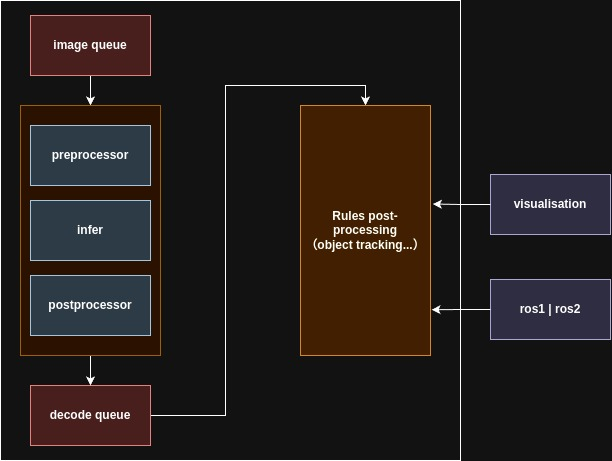

# Framework  

 

## 1. Model Inference
The inference framework is divided into three modules: pre-processing, inference, and decoding, and the object tracking part is another sub-thread.

The flow of the framework is shown below

Frame output can be connected to middleware ros1, ros2, or other middleware.
