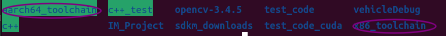

# Installation


## 1. Environment Setup
### 1.1 Docker development cross-compile environment build
This warehouse provides two ways to build docker environment, the first directly download docker image can be developed full image, the second separation of third-party libraries stored in the local environment, download the minimized image.
- The first complete mirror image

    Mirror address: Docker hub address：[cross-aarch64_dev](https://hub.docker.com/r/liwuhen/cross-aarch64_dev)

    Container startup commands：
    ```shell
    docker run -it --gpus all --network host --privileged  --cap-add=SYS_PTRACE --security-opt seccomp=unconfined -e DISPLAY=$DISPLAY -e GDK_SCALE -e GDK_DPI_SCALE -v /tmp/.X11-unix:/tmp/.X11-unix -v /home/:/home/  --name cross-aarch64_container cross-aarch64_dev:latest  bash
    ```

- Second minimized mirror (recommended)

    Docker file to generate an image：
    ```shell
    #!/bin/bash
    ./docker/build_docker.sh --file docker/ubuntu-cross-aarch64.Dockerfile --tag cross-aarch64_dev
    ```
    Container startup commands：
    ```shell
    docker run -it --gpus all --network host --privileged  --cap-add=SYS_PTRACE --security-opt seccomp=unconfined -e DISPLAY=$DISPLAY -e GDK_SCALE -e GDK_DPI_SCALE -v /tmp/.X11-unix:/tmp/.X11-unix -v /home/:/home/  --name cross-aarch64_container cross-aarch64_dev:latest  bash
    ```

### 1.2 Local cross-compilation environment setup

    Configure the environment directory of third-party libraries, the author will store the third-party libraries in a fixed directory on the local computer, configure the environment variables to facilitate cross-compilation.



